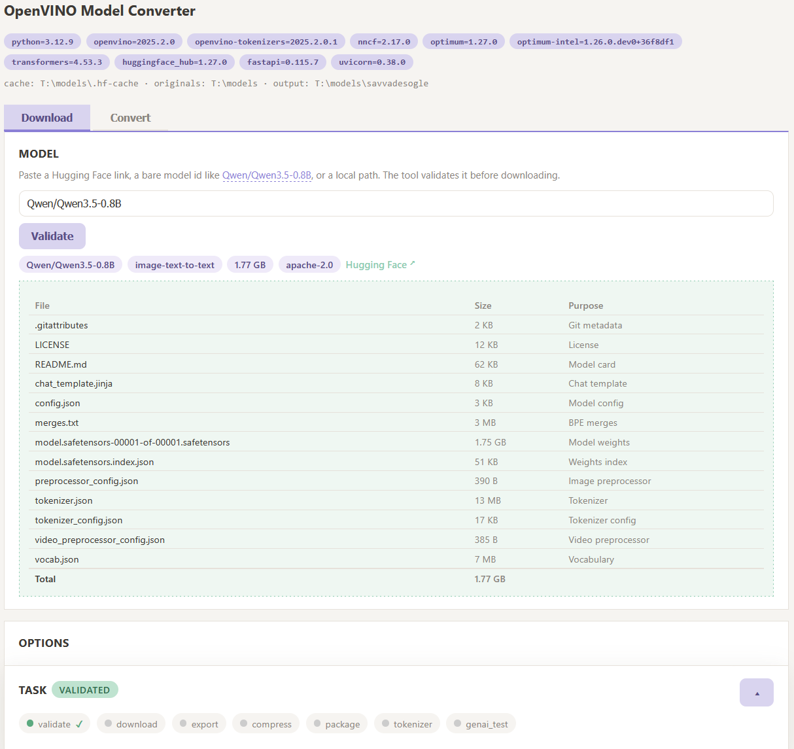

# openvino-model-converter-webui

Download Hugging Face models and convert them to OpenVINO (`int2` / `int3` /
`int4` / `int8` / `nf4` / ...) through a minimal two-tab web UI.



- **Tab 1 - Download**: paste a HF link or model id (`Qwen/Qwen3.5-0.8B`),
  validate it, download into `T:\models\<org>\<model>` (HF/xet cache on `T:`).
- **Tab 2 - Convert**: pick a model, choose a weight-compression mode (the list
  is loaded dynamically from the installed `nncf` version), configure group
  size / mixed precision / data-aware methods, run the conversion, get a
  HF-compatible model card + a GenAI end-to-end sanity check.

```
source (dense BF16) --export--> <Base>-fp16-ov --NNCF compress--> <Base>-int2-ov
                          (intermediate dense IR)
```

## Layout

| Path | Purpose |
|---|---|
| `T:\models\.hf-cache` | HF + xet cache (always on `T:`) |
| `T:\models\<org>\<model>` | original downloaded models |
| `T:\models\savvadesogle\<Base>-<mode>-ov` | converted OpenVINO models |

## Install & run

```bash
python -m venv .venv && .venv\Scripts\activate
pip install -r requirements.txt
uvicorn webui.main:app --host 127.0.0.1 --port 8000
# open http://127.0.0.1:8000
```

## CLI (headless, same core logic)

```bash
python -m ov_converter.pipeline config.json
```

## Module map

- `ov_converter/hf.py` - link parsing, validation, `hf download`
- `ov_converter/scan.py` - local model scanner (excludes GGUF / already-OV / quantized)
- `ov_converter/export.py` - dense fp16 export via optimum-cli
- `ov_converter/compress.py` - NNCF compression (single-mode, two-pass int2-mix)
- `ov_converter/package.py` - tokenizer/config copy, HF README card, manifest.json
- `ov_converter/genai_test.py` - E2E check via OpenVINO GenAI
- `ov_converter/checks.py` - disk / virtual-memory / parameter validation
- `webui/` - FastAPI + SSE + flat pastel single-page UI

See `PLAN.md` for the full design. For a complete, self-contained technical
overview (modules, routes, data flow, environment gotchas, testing workflow)
read **`ARCHITECTURE.md`** — a new agent can bootstrap from that file alone.
